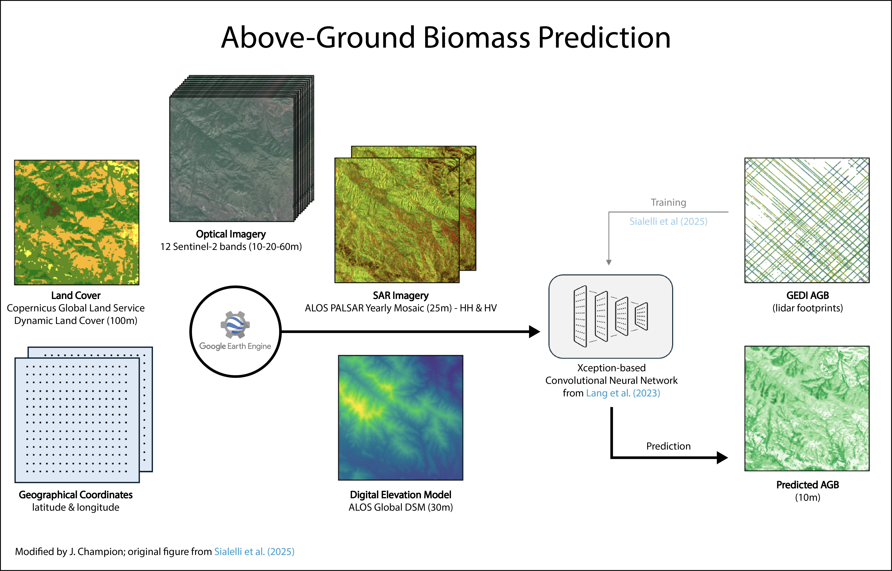

[](https://github.com/championjeyson/agb-prediction/actions/workflows/ci.yml)
[](https://colab.research.google.com/github/championjeyson/agb-prediction/blob/main/notebooks/demo_inference.ipynb)

[](https://creativecommons.org/licenses/by-nc/4.0/)
[](https://isprs-annals.copernicus.org/articles/X-G-2025/829/2025/)
[](https://huggingface.co/datasets/prs-eth/AGBD)
[](https://github.com/ghjuliasialelli/AGBD)

> ⚠️ **Notice (November 10, 2025)**  
> A part of the pipeline is currently under review with the original authors and will be updated in the next few days. Please check back soon — this warning will be removed once the review is complete.



# Above-Ground Biomass (AGB) Prediction

This repository implements the **inference stage** of the model described and trained on the **AGBD** (*Above-Ground Biomass Dataset*):

> **Sialelli, G., Peters, T., Wegner, J. D., and Schindler, K. (2025).**  
> *AGBD: A Global-scale Biomass Dataset.*  
> *ISPRS Ann. Photogramm. Remote Sens. Spatial Inf. Sci.*, X-G-2025, 829–838.  
> [https://doi.org/10.5194/isprs-annals-X-G-2025-829-2025](https://doi.org/10.5194/isprs-annals-X-G-2025-829-2025)


## 🚀 Overview

This project provides a reproducible pipeline for **biomass inference from multi-sensor satellite imagery**, integrating:
- Modular and tested Python codebase (`src/`)
- Configurable YAML-based model setup (`configs/`)
- Pretrained model weights for the best-performing architecture
- Jupyter notebook demo and command-line inference script
- Continuous Integration checks with GitHub Actions

---

## 🛰️ Data Preparation

The pipeline uses the following input data layers, extracted as they are by default using Google Earth Engine (GEE):

| Dataset | Description | Resolution | Source |
|----------|-------------|-------------|--------|
| **Sentinel-2 L2A** | Optical surface reflectance bands (visible to SWIR) | 10–60 m | ESA Copernicus Programme |
| **ALOS PALSAR-2** | L-band radar backscatter (HH, HV polarizations) | 25 m | JAXA |
| **ALOS Global Digital Surface Model (AW3D30)** | Global digital elevation model | 30 m | JAXA |
| **Dynamic Land Cover (CGLS-LC100)** | Global land cover classification | 100 m | Copernicus Global Land Service |


📜 **GEE script** for input data download:  
To apply the pipeline to another area of interest, you can use this script to prepare all necessary inputs:  
👉 [Google Earth Engine Code](https://code.earthengine.google.com/af9dcf4d48f154082386ae82de1c69f6)

The pipeline handles reprojection, resampling, and encoding automatically.

## 🧠 Model Inference Demo

You can run inference in two ways:

### 1. Command-line script
From the project root:
```bash
python scripts/run_inference.py
```

### 2. Colab notebook

A ready-to-run notebook is available:
👉 [Run on Google Colab](https://colab.research.google.com/github/championjeyson/agb-prediction/blob/main/notebooks/demo_inference.ipynb)

---

## ⚙️ Installation

### 📦 Large Files

Model weights and sample images are stored via **Git LFS**. Install it before cloning the repository:

```bash
git lfs install
```

If missing, the large files (e.g., model weights) won’t be downloaded. 

You can alternatively fetch the pretrained model from the [original ETH Zürich repository](https://libdrive.ethz.ch/index.php/s/VPio6i5UlXTgir0?path=%2Fpretrained_weights). The "nico" architecture weights are required.

### Git Installation

```bash
git clone https://github.com/championjeyson/agb-prediction.git
cd agb-prediction
python -m venv .venv
source .venv/bin/activate      # or .venv\Scripts\activate on Windows
pip install -r requirements.txt
```

---

## 📄 License

This repository is distributed under the  
**Creative Commons Attribution–NonCommercial 4.0 International License (CC BY-NC 4.0)**.  
See [LICENSE](LICENSE.md) for details.

## 🙏 Acknowledgment

This implementation builds upon the foundational work of  **Sialelli et al. (2025)** and their open-source [AGBD codebase](https://github.com/ghjuliasialelli/AGBD).  
Please cite both this repository and the original publication when using the model.

## 🌍 Citation

If you use this code or model in academic work, please cite:

```bibtex
@article{sialelli2025agbd,
  title     = {AGBD: A Global-scale Biomass Dataset},
  author    = {Sialelli, G. and Peters, T. and Wegner, J. D. and Schindler, K.},
  journal   = {ISPRS Ann. Photogramm. Remote Sens. Spatial Inf. Sci.},
  volume    = {X-G-2025},
  pages     = {829--838},
  year      = {2025},
  doi       = {10.5194/isprs-annals-X-G-2025-829-2025}
}
